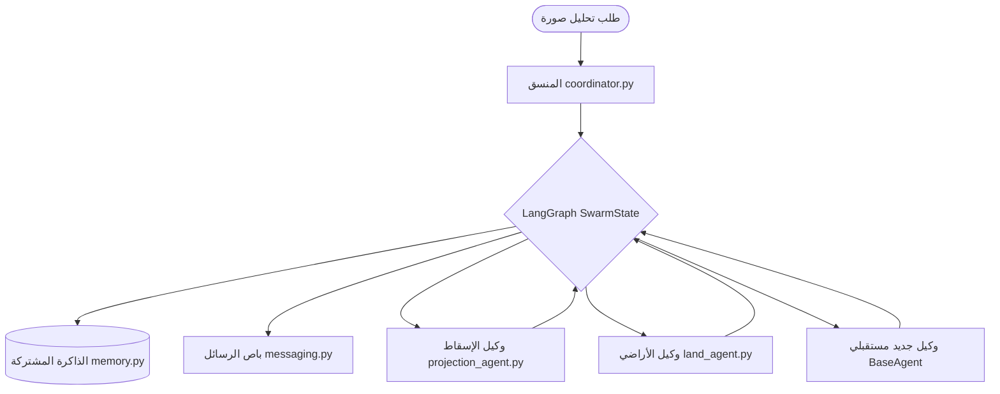

# دليل المطورين لنظام فريق الوكلاء المساحي (Geo-AI Swarm Framework)

مرحباً بك في البنية التحتية الخلفية لنظام فريق الوكلاء المخصص للتحليل الجغرافي وحساب المساحات الزراعية لصالح هيئة الأوقاف. 

تم تصميم هذا النظام ليكون **قابل للتوسيع بالكامل (Plug-and-Play)** بحيث يستطيع أي مطور قراءة هذا الدليل، وإنشاء وكيل خبير جديد (مثلاً: وكيل الطرق، أو وكيل المباني)، وتوصيله بالفريق دون الحاجة لتعديل النواة البرمجية للمنسق.

---

## 🏗️ هيكلية وبنية النظام (Architecture)

يعتمد النظام على **LangGraph** لتنسيق التدفق، وقاعدة بيانات **SQLite** لتمثيل الذاكرة المشتركة، مع **باص رسائل (Message Bus)** داخلي لتأمين التواصل المستمر والأرشفة التلقائية للأحداث.



### المكونات الرئيسية في مجلد `agent_system/`:

1. **`base.py` (Base Agent SDK):** يحتوي على الفئة الأساسية المجردة `BaseAgent`. يجب أن ترث جميع فئات الوكلاء الجدد من هذه الفئة.
2. **`memory.py` (Shared Memory):** يدير الاتصال بقاعدة البيانات المحلية `shared_memory.db` التي تحفظ تفاصيل المهام والطبقات المعزولة وسجلات تخاطب الوكلاء.
3. **`messaging.py` (Message Bus):** يدير توزيع ونشر السجلات والتحذيرات والنتائج وتخزينها تلقائياً وتنسيق طباعتها.
4. **`coordinator.py` (Orchestrator):** العقل المدبر الذي يحدد الخطوة التالية بناءً على حالة التخزين وقائمة الوكلاء النشطين.
5. **`graph.py` (State Graph):** يقوم ببناء وجمع عقد وحواف الرسم البياني لـ LangGraph.

---

## 🛠️ دليل المطور: كيف تقوم بإضافة وكيل خبير جديد؟

لإضافة وكيل خبير جديد (على سبيل المثال: وكيل الطرق `road_agent` لتصنيف الطرق إلى معبدة، ترابية، أو مسارات جبلية):

### الخطوة 1: إنشاء ملف الوكيل الجديد
قم بإنشاء ملف جديد في حزمة `agent_system` باسم `road_agent.py` وقم بتعريف الفئة التي ترث من `BaseAgent`:

```python
# agent_system/road_agent.py
from typing import Dict, Any
from agent_system.base import BaseAgent
from agent_system.memory import SharedMemory
from agent_system.messaging import MessageBus

class RoadAgent(BaseAgent):
    def __init__(self, message_bus: MessageBus):
        super().__init__("road_agent")  # اسم الوكيل الفريد
        self.message_bus = message_bus

    def run(self, state: Dict[str, Any], memory: SharedMemory) -> Dict[str, Any]:
        task_id = state.get("task_id")
        
        # 1. إرسال إشعار ببدء العمل عبر باص الرسائل
        self.message_bus.publish(
            task_id=task_id,
            sender=self.name,
            message_type="START",
            content="بدء تصنيف شبكة الطرق والممرات المستخرجة."
        )
        
        # 2. قراءة طبقة الطرق من الذاكرة المشتركة
        layers = memory.get_task_layers(task_id, layer_name="roads")
        
        # 3. معالجة وتصنيف المضلعات (يمكن استدعاء نموذج ذكاء اصطناعي هنا لاحقاً)
        for layer in layers:
            layer_id = layer["layer_id"]
            
            # (مثال محاكاة تصنيف ممر مساحي محلي)
            local_road_class = "طَرِيق سُلْطَانِيَّة" if layer["area_sq_meters"] > 5000 else "مَخْلَف ترابي"
            
            # تحديث بيانات الميتا في قاعدة البيانات
            with memory._get_connection() as conn:
                import json
                meta = layer["metadata"] or {}
                meta["road_class"] = local_road_class
                conn.execute(
                    "UPDATE task_layers SET metadata = ? WHERE layer_id = ?",
                    (json.dumps(meta), layer_id)
                )
                conn.commit()
                
            self.message_bus.publish(
                task_id=task_id,
                sender=self.name,
                message_type="RESULT",
                content=f"تم تصنيف الطريق رقم {layer_id} كـ: {local_road_class}"
            )
            
        # 4. إعلان اكتمال العمل وإرجاع التحديث للحالة
        self.message_bus.publish(
            task_id=task_id,
            sender=self.name,
            message_type="COMPLETED",
            content="اكتمل تصنيف شبكة الطرق بنجاح."
        )
        
        # إضافة الوكيل لقائمة التخصصات المكتملة وإرجاع التحكم للمنسق
        completed = state.get("completed_specialists", [])[:]
        completed.append(self.name)
        
        return {
            "completed_specialists": completed,
            "next_agent": "coordinator"
        }
```

### الخطوة 2: تسجيل الوكيل الجديد في الرسم البياني `graph.py`
افتح الملف [agent_system/graph.py](file:///e:/الاوقاف/LandClassificationProject/agent_system/graph.py) وقم بالتعديلات التالية:

1. استيراد فئة الوكيل الجديد:
   ```python
   from agent_system.road_agent import RoadAgent
   ```
2. إضافة الوكيل كعقدة (Node) داخل دالة `create_swarm_graph`:
   ```python
   road_agent = RoadAgent(message_bus)
   workflow.add_node("road_agent", lambda state: road_agent.run(state, memory))
   ```
3. تعريف مسار العودة الافتراضي للمنسق:
   ```python
   workflow.add_edge("road_agent", "coordinator")
   ```
4. تحديث التوجيه الشرطي للمنسق (router) ليتضمن العقدة الجديدة:
   ```python
   def router(state: SwarmState) -> str:
       next_step = state.get("next_agent", "end")
       if next_step in ["projection_agent", "land_agent", "road_agent"]:
           return next_step
       return "end"
       
   workflow.add_conditional_edges(
       "coordinator",
       router,
       {
           "projection_agent": "projection_agent",
           "land_agent": "land_agent",
           "road_agent": "road_agent",
           "end": END
       }
   )
   ```

### الخطوة 3: تفعيل الوكيل في المنسق `coordinator.py`
افتح الملف [agent_system/coordinator.py](file:///e:/الاوقاف/LandClassificationProject/agent_system/coordinator.py) وأضف اسم الوكيل الجديد لقائمة الوكلاء النشطين عند تهيئة المنسق:
```python
# في السكربت الرئيسي أو داخل كلاس المنسق
self.active_specialists = active_specialists or ["land_agent", "road_agent"]
```

---

## 📏 معادلات الإسقاط وحساب المساحة

يقوم وكيل الإسقاط بحساب المساحات طبقاً للمعايير التالية:
- **المتر المربع**: $Area_{pixels} \times GSD^2$ (حيث GSD هو مقياس رسم البكسل بالأمتار).
- **الفدان**: الجزء الصحيح من قسمة المساحة على $4200.83$.
- **القيراط**: الجزء الصحيح من قسمة المتبقي على $175.03$.
- **السهم**: ناتج قسمة المتبقي الأخير على $7.29$ (يقرب لرقمين عشريين).

---

## 🏃 تشغيل النظام للتحقق والاختبار

لتشغيل محاكاة تدفق النظام واختبار كافة العمليات البرمجية والتخزين في SQLite، قم بتشغيل السكربت التالي في الطرفية:

```bash
.\venv\Scripts\python.exe run_agent_system.py
```

سيقوم السكربت بـ:
1. تنظيف قاعدة البيانات وتهيئتها من جديد.
2. إنشاء مهمة برقم معرف `task_demo_001`.
3. إمرار الحالة بين المنسق، وكيل الإسقاط، ووكيل الأراضي بالتوالي عبر LangGraph.
4. طباعة جداول تقرير المساحات المسقطة والقاموس المحلي للقطع.
5. عرض باص الرسائل بالكامل بصورة مرئية وجمالية فائقة.
